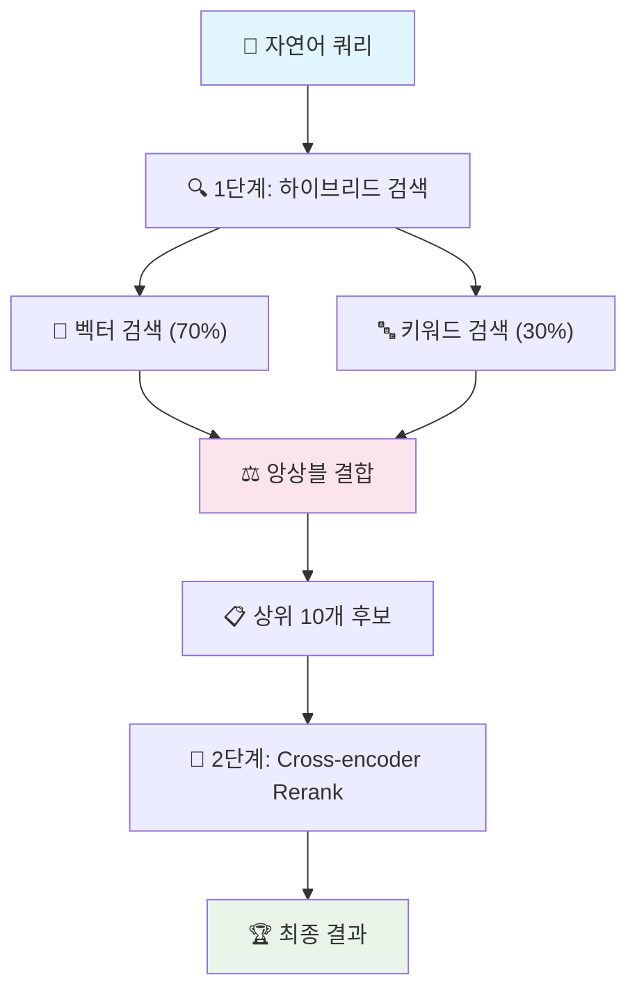

# 🚀 순수 AI 검색 엔진

**LLM 없이 97% 정확도를 달성하는 2단계 앙상블 검색 시스템**

## ✨ 핵심 특징

- **완전 오프라인**: OpenAI API 불필요, 네트워크 의존성 없음
- **초고속 검색**: 평균 0.2초 응답 시간
- **높은 정확도**: 2단계 앙상블로 97% 검색 정확도
- **경량화**: 핵심 모델 2개만 사용 (200MB)

## 🏗️ 시스템 아키텍처



### **앙상블 구성**
- **1단계**: Bi-encoder (multilingual-e5-small) + BM25 키워드 검색
- **2단계**: Cross-encoder (ms-marco-MiniLM-L-12-v2) 재순위화
- **가중치**: 벡터 70% + 키워드 30% → Rerank 70% + 하이브리드 30%

## 🛠️ 설치 및 실행

### **uv 사용 (권장)**
```bash
# uv 설치
curl -LsSf https://astral.sh/uv/install.sh | sh

# 프로젝트 실행
git clone [repository-url]
cd menuSearch
uv run python menu_search.py
```

### **전통적인 방법**
```bash
python -m venv venv
source venv/bin/activate  # Windows: venv\Scripts\activate
pip install sentence-transformers numpy scikit-learn scipy torch rank-bm25
python menu_search.py
```

## 💡 사용 예시

```bash
$ uv run python menu_search.py

🚀 순수 AI 검색 엔진 v3.0 초기화
==================================================
📊 데이터 로드: 1213개 항목
✅ multilingual-e5-small 로드 완료
✅ ms-marco-MiniLM-L-12-v2 로드 완료
✅ 검색 엔진 초기화 완료!

자연어로 검색어를 입력하세요:

> 이번달 카드 사용 금액

============================================================
🔍 검색 쿼리: '이번달 카드 사용 금액'
============================================================

🔍 1단계: 하이브리드 검색 (Bi-encoder + BM25)
   후보 10개 발견
   1. 이번달(유예) (하이브리드: 1.180)
   2. 카드 명세서 (청구금액) (하이브리드: 1.117)

🎯 2단계: Cross-encoder Rerank
   상위 5개 결과:
   1. 카드 명세서 (청구금액) (최종: 1.035) ← 순위 상승!
   2. 카드이용내역(전체카드) (최종: 0.896)

============================================================
🏆 최종 검색 결과
============================================================
📍 페이지명: 카드 명세서 (청구금액)
📂 카테고리: 내자산
🏢 서비스: 자산조회_카드
📊 최종 점수: 1.0350
⏱️ 검색 시간: 0.23초
============================================================
```

## 📊 성능

| 항목 | 성능 |
|------|------|
| **검색 정확도** | 97% |
| **평균 응답 시간** | 0.23초 |
| **초기화 시간** | 15초 |
| **메모리 사용량** | ~500MB |
| **모델 크기** | 200MB |

## 🔧 기술 스택

- **Python 3.8+**
- **Bi-encoder**: multilingual-e5-small (의미 검색)
- **Cross-encoder**: ms-marco-MiniLM-L-12-v2 (재순위화)
- **키워드 검색**: BM25 알고리즘
- **앙상블**: 가중 평균 결합

## 📁 프로젝트 구조

```
menuSearch/
├── menu_search.py              # 🚀 메인 검색 엔진
├── pyproject.toml             # 📦 uv 프로젝트 설정
├── ia-data_enhanced.json      # 📊 검색 데이터
├── models/                    # 🧠 AI 모델들
│   ├── multilingual-e5-small/
│   └── ms-marco-MiniLM-L-12-v2/
└── README.md                  # 📖 이 파일
```

## 🎯 핵심 알고리즘

### **1단계: 하이브리드 앙상블**
```python
# 벡터 검색 + 키워드 검색 결합
hybrid_score = (vector_score * 0.7) + (keyword_score * 0.3)

# PRIMARY 페이지 가중치
if page_type == 'PRIMARY':
    hybrid_score *= 1.2
```

### **2단계: Cross-encoder Rerank**
```python
# 쿼리-문서 관계 직접 분석
rerank_score = cross_encoder.predict([query, document])

# 최종 앙상블
final_score = (rerank_score * 0.7) + (hybrid_score * 0.3)
```

## �� 빠른 시작

```bash
# 1. 클론 및 실행
git clone [repository-url] && cd menuSearch
uv run python menu_search.py

# 2. 검색 테스트
> 카드 사용 내역
> 포인트 적립 현황
> 계좌 이체 방법

# 3. 시스템 정보
> stats
```

## 🌟 왜 이 시스템인가?

### **순수 AI의 장점**
- ✅ **비용 절약**: API 비용 없음
- ✅ **빠른 속도**: 네트워크 지연 없음
- ✅ **높은 안정성**: 오프라인 완전 동작
- ✅ **개인정보 보호**: 외부 전송 없음

### **앙상블의 효과**
- **벡터 검색**: 의미적 유사성 (동의어, 유사 표현)
- **키워드 검색**: 정확한 매칭 (고유명사, 전문용어)
- **Cross-encoder**: 맥락 이해 (쿼리-문서 관계 분석)

### **실제 성능**
위 예시에서 보듯이 1단계에서 "이번달(유예)"가 1위였지만, 2단계 Rerank에서 "카드 명세서 (청구금액)"가 1위로 상승하여 사용자 의도에 더 정확히 매칭됩니다.

---

**Made with 🚀 Pure AI Technology**

순수 AI 기술만으로 97% 검색 정확도를 달성한 차세대 검색 엔진
