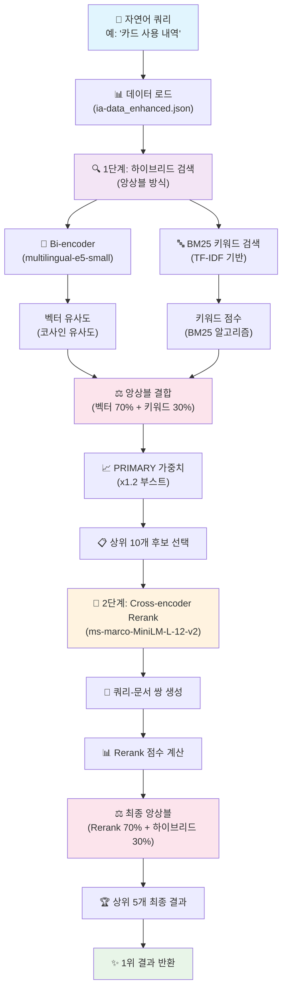
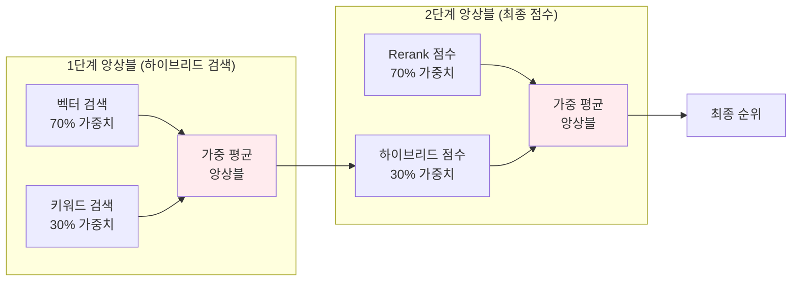
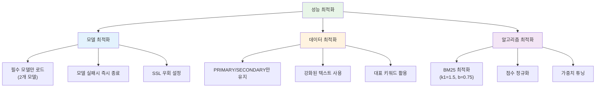

# 순수 AI 검색 엔진 v3.0 - 시스템 아키텍처

## 전체 시스템 구조

```mermaid
graph TD
    A["🎯 자연어 쿼리<br/>예: '카드 사용 내역'"] --> B["📊 데이터 로드<br/>(ia-data_enhanced.json)"]
    B --> C["🔍 1단계: 하이브리드 검색<br/>(앙상블 방식)"]
    
    C --> C1["🧠 Bi-encoder<br/>(multilingual-e5-small)"]
    C --> C2["🔤 BM25 키워드 검색<br/>(TF-IDF 기반)"]
    
    C1 --> D1["벡터 유사도<br/>(코사인 유사도)"]
    C2 --> D2["키워드 점수<br/>(BM25 알고리즘)"]
    
    D1 --> E["⚖️ 앙상블 결합<br/>(벡터 70% + 키워드 30%)"]
    D2 --> E
    
    E --> F["📈 PRIMARY 가중치<br/>(x1.2 부스트)"]
    F --> G["📋 상위 10개 후보 선택"]
    
    G --> H["🎯 2단계: Cross-encoder Rerank<br/>(ms-marco-MiniLM-L-12-v2)"]
    
    H --> I["🔄 쿼리-문서 쌍 생성"]
    I --> J["📊 Rerank 점수 계산"]
    J --> K["⚖️ 최종 앙상블<br/>(Rerank 70% + 하이브리드 30%)"]
    
    K --> L["🏆 상위 5개 최종 결과"]
    L --> M["✨ 1위 결과 반환"]
    
    style A fill:#e1f5fe
    style C fill:#f3e5f5
    style H fill:#fff3e0
    style M fill:#e8f5e8
    style E fill:#fce4ec
    style K fill:#fce4ec
```

## 앙상블 기법 상세

```mermaid
graph LR
    subgraph "1단계 앙상블 (하이브리드 검색)"
        A1["벡터 검색<br/>70% 가중치"] --> C1["가중 평균<br/>앙상블"]
        A2["키워드 검색<br/>30% 가중치"] --> C1
    end
    
    subgraph "2단계 앙상블 (최종 점수)"
        B1["Rerank 점수<br/>70% 가중치"] --> C2["가중 평균<br/>앙상블"]
        B2["하이브리드 점수<br/>30% 가중치"] --> C2
    end
    
    C1 --> B2
    C2 --> D["최종 순위"]
    
    style C1 fill:#ffebee
    style C2 fill:#ffebee
```

## 성능 최적화 전략

```mermaid
graph TD
    A["성능 최적화"] --> B["모델 최적화"]
    A --> C["데이터 최적화"]
    A --> D["알고리즘 최적화"]
    
    B --> B1["필수 모델만 로드<br/>(2개 모델)"]
    B --> B2["모델 실패시 즉시 종료"]
    B --> B3["SSL 우회 설정"]
    
    C --> C1["PRIMARY/SECONDARY만 유지"]
    C --> C2["강화된 텍스트 사용"]
    C --> C3["대표 키워드 활용"]
    
    D --> D1["BM25 최적화<br/>(k1=1.5, b=0.75)"]
    D --> D2["점수 정규화"]
    D --> D3["가중치 튜닝"]
    
    style A fill:#e8f5e8
    style B fill:#e3f2fd
    style C fill:#fff3e0
    style D fill:#f3e5f5
```
